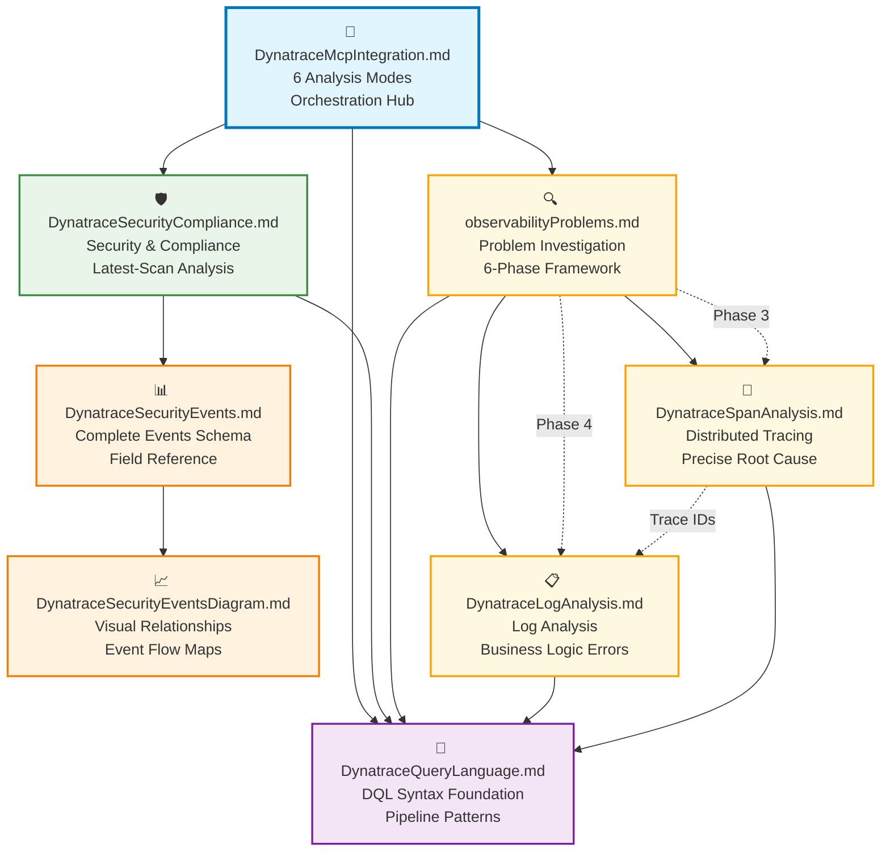

# Dynatrace Observability Workshop Rules

This directory contains comprehensive workflow rules for AI-assisted Dynatrace analysis through the MCP (Model Context Protocol) integration. The rules enable complete observability analysis across security, compliance, problems, logs, and distributed tracing.

_Disclaimer: For the best results, we recommend using Claude Sonnet 4 as the base model._

## 🚀 **Quick Start**

### 1. Install Dynatrace MCP Server

```bash
npm install -g @dynatrace-oss/dynatrace-mcp-server
# Configure with your Dynatrace environment credentials
```

### 2. Copy Integration Rules to Your IDE

Copy all 9 rule files to your AI assistant's rules directory:

**IDE-Specific Locations:**

- **Amazon Q**: `.amazonq/rules/` (project) or `~/.aws/amazonq/rules/` (global)
- **Cursor**: `.cursor/rules/` (project) or via Settings → Rules (global)
- **Windsurf**: `.windsurfrules/` (project) or via Customizations → Rules (global)
- **Cline**: `.clinerules/` (project) or `~/Documents/Cline/Rules/` (global)
- **GitHub Copilot**: `.github/copilot-instructions.md` (project only)

### 3. Initialize the Agent

In your AI chat:

```
load dynatrace mcp
```

The Dynatrace observability agent will activate with full analysis capabilities.

## 🏗️ **Architecture Overview**

### **Required Rule Files (9 Total)**

- `DynatraceMcpIntegration.md` - **Main orchestration hub** (6 analysis modes)
- `DynatraceQueryLanguage.md` - **Core DQL syntax foundation**
- `DynatraceSecurityCompliance.md` - **Security & compliance workflows**
- `DynatraceSecurityEvents.md` - **Complete events schema reference**
- `DynatraceSecurityEventsDiagram.md` - **Visual relationship mappings**
- `observabilityProblems.md` - **Complete problem investigation framework**
- `DynatraceLogAnalysis.md` - **Comprehensive log analysis patterns**
- `DynatraceSpanAnalysis.md` - **Distributed tracing & root cause analysis**
- `README.md` - **This workflow overview document**

### **Workflow Connectivity Map**



## 🎯 **Analysis Modes & Workflows**

### **1. Security & Vulnerability Analysis**

**Primary Workflow**: DynatraceMcpIntegration.md → DynatraceSecurityCompliance.md → DynatraceSecurityEvents.md

- **Latest-scan analysis** prevents outdated data aggregation
- **Extended timeframes** (24h+) for cloud provider scans
- **Real-time vulnerability correlation** with Davis AI assessment
- **Container image security** with component-level analysis

### **2. Compliance Monitoring**

**Primary Workflow**: DynatraceMcpIntegration.md → DynatraceSecurityCompliance.md → DynatraceQueryLanguage.md

- **Multi-cloud compliance** (AWS, Azure, GCP, Kubernetes)
- **Evidence-based investigation** with detailed remediation paths
- **Risk-based scoring** and team-specific guidance
- **Configuration drift detection** and alert optimization

### **3. Problem Investigation**

**Primary Workflow**: observabilityProblems.md → DynatraceSpanAnalysis.md → DynatraceLogAnalysis.md

- **6-phase systematic investigation** framework
- **Complete trace correlation** (problems → spans → logs)
- **Precise root cause identification** with file/line numbers
- **Business logic error detection** patterns

### **4. Distributed Tracing Analysis**

**Primary Workflow**: DynatraceSpanAnalysis.md → DynatraceQueryLanguage.md

- **Exception details extraction** with full stack traces
- **Performance impact correlation** across services
- **Failure pattern analysis** and error rate calculations
- **Multi-service cascade analysis**

### **5. Log Analysis & Troubleshooting**

**Primary Workflow**: DynatraceLogAnalysis.md → DynatraceQueryLanguage.md

- **Business logic error patterns** detection
- **Deployment correlation analysis** with ArgoCD/GitOps
- **High-frequency error identification** and rate analysis
- **Cross-service error correlation**

### **6. Custom DQL Analysis**

**Primary Workflow**: DynatraceQueryLanguage.md + any domain-specific files

- **Advanced query patterns** with semantic field discovery
- **Entity relationship mapping** across infrastructure
- **Time-series analysis** and trend identification
- **Cross-platform data correlation**

## Usage Flow

### Security & Compliance Analysis

1. **Start**: User requests analysis → **DynatraceMcpIntegration.md** selects appropriate mode
2. **Query Building**: Mode uses **DynatraceQueryLanguage.md** for DQL syntax
3. **Security Analysis**: Compliance/vulnerability modes reference **DynatraceSecurityCompliance.md**
4. **Data Understanding**: All modes can reference **DynatraceSecurityEvents.md** for event structure
5. **Visualization**: Complex relationships explained via **DynatraceSecurityEventsDiagram.md**

### Problem Investigation Workflow

1. **Problem Discovery**: Start with **observabilityProblems.md** systematic approach
2. **Span Analysis**: Use **DynatraceSpanAnalysis.md** for precise root cause identification
3. **Log Correlation**: Apply **DynatraceLogAnalysis.md** patterns for validation and context
4. **DQL Foundation**: All analysis modes leverage **DynatraceQueryLanguage.md** syntax
5. **Integration**: Complete problem-span-log correlation for comprehensive resolution

## Key Principles

- **DQL-First Approach**: Prefer DQL queries over native MCP calls for vulnerability analysis
- **Latest Scan Focus**: Always analyze most recent scan data, never aggregate over time
- **Extended Timeframes**: Use 24h+ for cloud provider findings, default for Kubernetes
- **Remediation-Driven**: Always offer follow-up remediation options after analysis

## Quick Reference

| Analysis Type                | Primary File                   | Supporting Files                                      |
| ---------------------------- | ------------------------------ | ----------------------------------------------------- |
| **Security & Compliance**    |
| Vulnerabilities              | DynatraceMcpIntegration.md     | DynatraceQueryLanguage.md, DynatraceSecurityEvents.md |
| Compliance                   | DynatraceSecurityCompliance.md | DynatraceQueryLanguage.md, DynatraceSecurityEvents.md |
| Custom DQL                   | DynatraceQueryLanguage.md      | DynatraceSecurityEvents.md                            |
| Event Understanding          | DynatraceSecurityEvents.md     | DynatraceSecurityEventsDiagram.md                     |
| **Observability & Problems** |
| Problem Investigation        | observabilityProblems.md       | DynatraceSpanAnalysis.md, DynatraceLogAnalysis.md     |
| Span Analysis                | DynatraceSpanAnalysis.md       | DynatraceQueryLanguage.md                             |
| Log Analysis                 | DynatraceLogAnalysis.md        | DynatraceQueryLanguage.md                             |
| Distributed Tracing          | DynatraceSpanAnalysis.md       | observabilityProblems.md, DynatraceLogAnalysis.md     |
