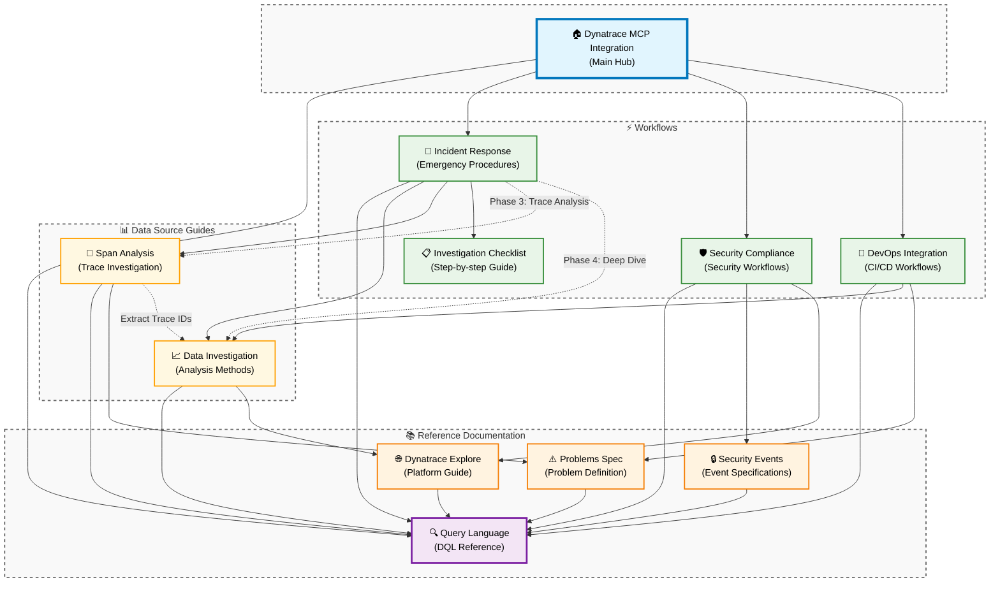

# Dynatrace Observability Workshop Rules

This directory contains comprehensive workflow rules for AI-assisted Dynatrace analysis through the MCP (Model Context Protocol) integration. The rules enable complete observability analysis across security, compliance, problems, logs, and distributed tracing.

_Disclaimer: For the best results, we recommend using Claude Sonnet 4 as the base model._

## 🚀 **Quick Start**

### 1. Install Dynatrace MCP Server

```bash
npm install -g @dynatrace-oss/dynatrace-mcp-server
# Configure with your Dynatrace environment credentials
```

### 2. Copy Integration Rules to Your IDE

Copy all 11 rule files to your AI assistant's rules directory:

**IDE-Specific Locations:**

- **Amazon Q**: `.amazonq/rules/` (project) or `~/.aws/amazonq/rules/` (global)
- **Cursor**: `.cursor/rules/` (project) or via Settings → Rules (global)
- **Windsurf**: `.windsurfrules/` (project) or via Customizations → Rules (global)
- **Cline**: `.clinerules/` (project) or `~/Documents/Cline/Rules/` (global)
- **GitHub Copilot**: `.github/copilot-instructions.md` (project only)

### 3. Initialize the Agent

In your AI chat:

```
load dynatrace mcp
```

The Dynatrace observability agent will activate with full analysis capabilities.

## 🏗️ **Architecture Overview**

### **📁 Hierarchical Folder Structure**

```
dynatrace-agent-rules/rules/
├── DynatraceMcpIntegration.md                    # 🎯 MAIN ORCHESTRATOR
├── README.md                                     # 📖 THIS OVERVIEW DOCUMENT
├── workflows/                                    # 🔧 ANALYSIS WORKFLOWS
│   ├── DynatraceIncidentResponse.md             # Core incident investigation
│   ├── DynatraceSecurityCompliance.md           # Security & compliance analysis
│   ├── DynatraceDevOpsIntegration.md            # CI/CD automation & SRE
│   ├── DynatraceInvestigationChecklist.md       # Investigation procedures
│   └── dataSourceGuides/                        # 📊 DATA ANALYSIS GUIDES
│       ├── DynatraceDataInvestigation.md        # Multi-source data analysis
│       └── DynatraceSpanAnalysis.md             # Transaction tracing & root cause
└── reference/                                   # 📚 TECHNICAL DOCUMENTATION
    ├── DynatraceQueryLanguage.md                # DQL syntax foundation
    ├── DynatraceExplore.md                      # Field discovery patterns
    ├── DynatraceSecurityEvents.md               # Security events schema
    └── DynatraceProblemsSpec.md                 # Problems schema reference
```

### **Required Rule Files (11 Total)**

**Main Files:**

- `DynatraceMcpIntegration.md` - **Main orchestration hub** (6 analysis modes)
- `README.md` - **This workflow overview document**

**Workflows:**

- `workflows/DynatraceIncidentResponse.md` - **Core incident investigation framework**
- `workflows/DynatraceSecurityCompliance.md` - **Security & compliance workflows**
- `workflows/DynatraceDevOpsIntegration.md` - **CI/CD automation & SRE workflows**
- `workflows/DynatraceInvestigationChecklist.md` - **Investigation checklist and procedures**

**Data Source Guides:**

- `workflows/dataSourceGuides/DynatraceDataInvestigation.md` - **Comprehensive data analysis patterns**
- `workflows/dataSourceGuides/DynatraceSpanAnalysis.md` - **Distributed tracing & root cause analysis**

**Reference Documentation:**

- `reference/DynatraceQueryLanguage.md` - **Core DQL syntax foundation**
- `reference/DynatraceExplore.md` - **Field discovery patterns**
- `reference/DynatraceSecurityEvents.md` - **Security events schema reference**
- `reference/DynatraceProblemsSpec.md` - **Problems schema reference**

### **Workflow Connectivity Map**



## 🎯 **Analysis Modes & Workflows**

### **1. Incident Response & Problem Investigation**

**Primary Workflow**: DynatraceMcpIntegration.md → workflows/DynatraceIncidentResponse.md → workflows/dataSourceGuides/DynatraceSpanAnalysis.md

- **4-phase structured investigation** workflow (Detection → Impact → Root Cause → Resolution)
- **Cross-data source correlation** (problems → logs → spans → metrics)
- **Kubernetes-aware incident analysis** with namespace and pod context
- **User impact assessment** with Davis AI integration

### **2. Security & Vulnerability Analysis**

**Primary Workflow**: DynatraceMcpIntegration.md → workflows/DynatraceSecurityCompliance.md → reference/DynatraceSecurityEvents.md

- **Latest-scan analysis** prevents outdated data aggregation
- **Extended timeframes** (24h+) for cloud provider scans
- **Real-time vulnerability correlation** with Davis AI assessment
- **Container image security** with component-level analysis

### **3. DevOps & SRE Automation**

**Primary Workflow**: DynatraceMcpIntegration.md → workflows/DynatraceDevOpsIntegration.md → reference/DynatraceQueryLanguage.md

- **Deployment health gates** with automated promotion/rollback
- **SLO/SLI automation** with error budget calculations
- **Infrastructure as Code remediation** with auto-generated templates
- **Alert optimization workflows** with pattern recognition

### **4. Comprehensive Data Investigation**

**Primary Workflow**: workflows/dataSourceGuides/DynatraceDataInvestigation.md → reference/DynatraceQueryLanguage.md

- **Unified log-service-process analysis** in single workflow
- **Business logic error detection** patterns
- **Deployment correlation analysis** with ArgoCD/GitOps integration
- **Golden signals monitoring** (Rate, Errors, Duration, Saturation)

### **5. Distributed Tracing Analysis**

**Primary Workflow**: workflows/dataSourceGuides/DynatraceSpanAnalysis.md → reference/DynatraceQueryLanguage.md

- **Exception details extraction** with full stack traces
- **Performance impact correlation** across services
- **Failure pattern analysis** and error rate calculations
- **Multi-service cascade analysis**

### **6. Field Discovery & Exploration**

**Primary Workflow**: reference/DynatraceExplore.md → reference/DynatraceQueryLanguage.md

- **Advanced query patterns** with semantic field discovery
- **Entity relationship mapping** across infrastructure
- **Time-series analysis** and trend identification
- **Cross-platform data correlation**

## Usage Flow

### Incident Response & Problem Investigation

1. **Start**: User requests analysis → **DynatraceMcpIntegration.md** selects appropriate mode
2. **Investigation Framework**: Use **workflows/DynatraceIncidentResponse.md** for systematic 4-phase approach
3. **Data Analysis**: Apply **workflows/dataSourceGuides/DynatraceDataInvestigation.md** for multi-source correlation
4. **Transaction Analysis**: Use **workflows/dataSourceGuides/DynatraceSpanAnalysis.md** for precise root cause
5. **DQL Foundation**: All analysis modes leverage **reference/DynatraceQueryLanguage.md** syntax

### Security & Compliance Analysis

1. **Start**: User requests analysis → **DynatraceMcpIntegration.md** selects appropriate mode
2. **Security Analysis**: Compliance/vulnerability modes reference **workflows/DynatraceSecurityCompliance.md**
3. **Data Understanding**: All modes can reference **reference/DynatraceSecurityEvents.md** for event structure
4. **Field Discovery**: Use **reference/DynatraceExplore.md** for unknown field exploration
5. **Query Building**: Mode uses **reference/DynatraceQueryLanguage.md** for DQL syntax

### DevOps & SRE Workflows

1. **Automation Start**: **workflows/DynatraceDevOpsIntegration.md** for deployment and SRE workflows
2. **Problem Context**: Reference **reference/DynatraceProblemsSpec.md** for problem schema understanding
3. **Data Investigation**: Use **workflows/dataSourceGuides/DynatraceDataInvestigation.md** for service analysis
4. **Field Discovery**: Apply **reference/DynatraceExplore.md** for infrastructure mapping
5. **Query Optimization**: Leverage **reference/DynatraceQueryLanguage.md** for advanced patterns

## Key Principles

- **DQL-First Approach**: Prefer DQL queries over native MCP calls for vulnerability analysis
- **Latest Scan Focus**: Always analyze most recent scan data, never aggregate over time
- **Extended Timeframes**: Use 24h+ for cloud provider findings, default for Kubernetes
- **Remediation-Driven**: Always offer follow-up remediation options after analysis

## Quick Reference

| Analysis Type              | Primary File                                                   | Supporting Files                                                                   |
| -------------------------- | -------------------------------------------------------------- | ---------------------------------------------------------------------------------- |
| **Incident Response**      |
| Multi-Phase Investigation  | workflows/DynatraceIncidentResponse.md                         | workflows/dataSourceGuides/DynatraceDataInvestigation.md, DynatraceSpanAnalysis.md |
| Investigation Procedures   | workflows/DynatraceInvestigationChecklist.md                   | reference/DynatraceQueryLanguage.md                                                |
| **Security & Compliance**  |
| Security Analysis          | workflows/DynatraceSecurityCompliance.md                       | reference/DynatraceSecurityEvents.md, DynatraceQueryLanguage.md                    |
| Vulnerability Assessment   | DynatraceMcpIntegration.md                                     | workflows/DynatraceSecurityCompliance.md, reference/DynatraceSecurityEvents.md     |
| **DevOps & SRE**           |
| CI/CD Automation           | workflows/DynatraceDevOpsIntegration.md                        | reference/DynatraceQueryLanguage.md, DynatraceProblemsSpec.md                      |
| Deployment Health Gates    | workflows/DynatraceDevOpsIntegration.md                        | workflows/dataSourceGuides/DynatraceDataInvestigation.md                           |
| **Data Analysis**          |
| Multi-Source Investigation | workflows/dataSourceGuides/DynatraceDataInvestigation.md       | reference/DynatraceQueryLanguage.md, DynatraceExplore.md                           |
| Distributed Tracing        | workflows/dataSourceGuides/DynatraceSpanAnalysis.md            | reference/DynatraceQueryLanguage.md, DynatraceProblemsSpec.md                      |
| **Technical Reference**    |
| DQL Syntax & Patterns      | reference/DynatraceQueryLanguage.md                            | reference/DynatraceExplore.md                                                      |
| Field Discovery            | reference/DynatraceExplore.md                                  | reference/DynatraceQueryLanguage.md                                                |
| Schema Understanding       | reference/DynatraceSecurityEvents.md, DynatraceProblemsSpec.md | reference/DynatraceQueryLanguage.md                                                |
